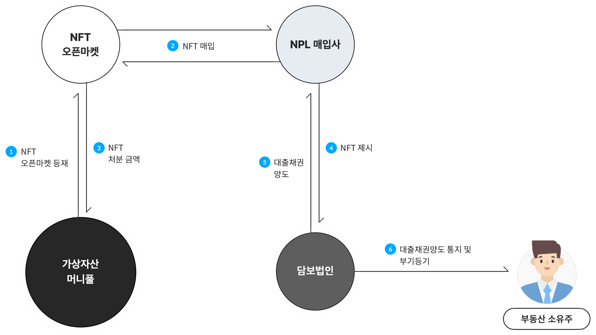

# 청산

담보물의 가치는 시간에 따라 바뀔 수 있고, 대출 금액이 담보 금액을 초과하면 엘리파이에 예치한 금액에 손실이 발생할 수 있습니다. 엘리파이에서는 손실 위험을 최소화하기 위해서, 대출금에 대한 담보가치 비율이 기준치보다 작아졌을 때, 담보물을 판매하고 대출금을 회수합니다. 이를 청산이라고 합니다. 청산 과정은 금전적으로나 시간상으로 손해가 크기에, 최대한 청산이 일어나지 않아야 합니다. 따라서 엘리파이에서는 등록된 담보 법인들이 여러 개의 담보에 적은 금액으로 분산 투자하도록 권고하고 있습니다.

담보물의 권리 실행은 온체인상에서 이루어지기 힘들고, 이루어지더라도 시간이 들기 때문에 이를 대신해주는 NPL 매입사를 청산 과정에 추가했습니다. 엘리파이의 담보물의 가치가 기준치보다 작아졌을 때, 아래와 같은 과정을 통해 청산을 진행합니다.

**1. 자산 채권 토큰 오픈마켓 등재**

대출자가 자산 채권 토큰에 기록된 만기 기한까지 대출 원금이 머니풀로 전송하지 않으면, 자산 채권 토큰은 자동으로 NFT 오픈마켓에 등재됩니다.

**2. 자산 채권 토큰 매입**

NPL 매입사는 오픈마켓에 등재된 자산 채권 토큰을 매입합니다. 이 때 NPL 매입사는 사전에 계약된 내용에 근거하여 자산 채권 토큰을 할인된 비용에 매입할 수 있습니다.

**3. 자산 채권 토큰 처분 금액 전송**

자산 채권 토큰 매입액을 머니풀 컨트랙트로 전송하면, 대출금 상환과 동시에 해당 자산 채권 토큰에 대한 대출이 종료됩니다.

**4. 자산 채권 토큰 제시**

NPL매입사는 담보 법인에 매입한 자산 채권 토큰을 제시합니다. 이는 오프체인, 또는 온체인으로 발생할 수 있습니다.

**5. 대출 채권 양도**

NPL 매입사는 매입한 자산 채권 토큰을 대부업체에 제시하고 실제 대출 채권을 대부업체로부터 양도받습니다.

**6. 대출 채권 양도 통지 및 부기등기**

대부업체는 대출자에게 채권 양도 사실을 통지하고 등기합니다. 이후 NPL 매입사는 경매를 통해 양도받은 담보의 경매 절차를 진행합니다.

위와 같은 과정을 통해 청산이 이루어지면, 실물 자산에 대한 권리를 온체인에서 실행하지 않고 바로 엘리파이의 자금 유동성을 회복할 수 있습니다.