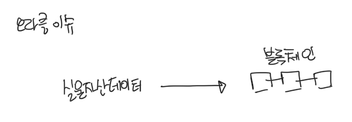

# 오라클 이슈

블록체인과 실물 자산의 데이터를 동기화하는 과정에서 항상 존재하는 “오라클 문제"가 가장 큰 위험입니다. 오라클 문제란 블록체인 밖에 있는 데이터를 블록체인 상에 기록되는 데이터를 어떻게 믿을 수 있는지에 관한 문제입니다. 엘리파이의 담보물 안정성을 위해서는 실물 자산의 데이터가 올바르게 블록체인에 기록되어야하고, 오류나 악의적으로 변경되어서는 안됩니다. 엘리파이에서는 오라클 이슈를 해결하기 위해, 대출계약과 실물 자산 데이터를 등록하는 과정에서 sELFI 토큰을 이용하는 방식을 선택했습니다.

엘리파이에서 자산 채권 토큰을 만드는 과정에서는 포럼(forum.elyfi.world)를 이용하여 데이터를 검증하게 됩니다. forum에서 문제가 없는 것으로 인정되면, 스냅샷(vote.elyfi.world)에서 대출에 대한 심사를 sELFI 토큰으로 투표하게 됩니다. 자산 채권 토큰 오라클 문제에서 벗어나 엘리파이가 안정적으로 유지되어야 sELFI 토큰의 가치를 유지할 수 있습니다. 즉, sELFI 토큰 보유자는 데이터 검증 및 대출 심사에 대해 적극적인 동기가 생깁니다.