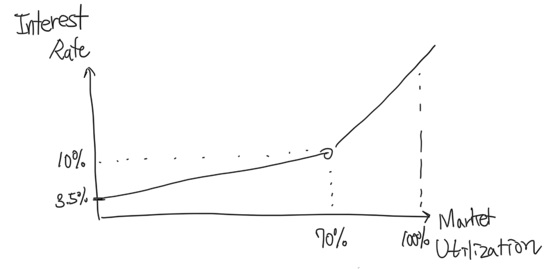

# 유동성 부족 문제

예치되있는 자금의 이탈이 크거나, 대출이 너무 많이 이루어질 경우 엘리파이 프로토콜 내 스테이블 코인이 부족한 상태 즉, 유동성이 부족하여 자금을 출금하지 못하는 경우도 발생할 수 있습니다. 유동성 부족 문제는 때때로 일어날 수 있습니다.

엘리파이에서는 유동성 부족 문제가 발생했을 때, 이자율 모델에 따라 자연스럽게 시장 참여에 따라 유동성 부족 문제가 해결됩니다. 엘리파이에서는 이자율 모델은 *kinked rates model* 을 사용하고 있습니다. 예치금 대비 대출금의 비율에 따라 이자율이 조정되며, 특정 비율에 도달하면 이자율이 급격하게 증가합니다. 유동성이 부족한 구간에서는 이자율을 높여 예치를 늘리고, 대출을 줄이는 방식으로 다시 유동성이 증가하는 방향으로 이동하게 됩니다. 아래 그래프는 대출금의 비율 대비 대출의 이자율을 보여주는 그래프입니다. 비율이 높아질 수록 이자율이 높아지나, 특정 점을 지나면 더 급격하게 증가하는 것을 볼 수 있습니다.

예를 들어 예치금으로 10억원, 대출금으로 6억원이 있고 이자율이 급격하게 증가하는 비율을 65%라고 가정해 봅시다. 현재는 대출금 / 예치금이 60%이기 때문에 이자율이 급격하게 증가하지 않습니다. 위 그래프에서 보면 이자율이 약 9%정도로 볼 수 있습니다. 만약 예치금이 3억원 줄어들어 7억원이 되었다고 해봅시다. 그럴 경우 대출금의 비율이 85%에 도달하여, 대출 이자율은 25%정도로 9%에 비해 약 2.5배 증가한 것을 볼 수 있습니다.