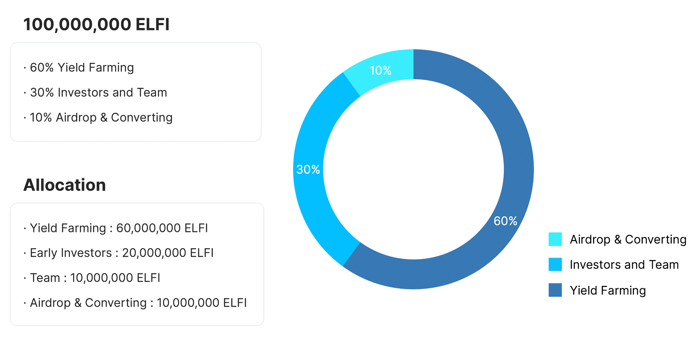

# 토큰 할당

1. Yield Farming : ELFI 총 발행량 중 60%에 해당합니다. 이 할당량은 엘리파이 생태계 참여를 유인하기 위한 것으로, 엘리파이에 예금하거나 대출 또는 ELFI 토큰을 스테이킹할 경우 분배됩니다.
2. Airdrop & Converting : 엘리파이 초기 생태계 활성화를 위해 기존 EL 토큰 홀더를 대상으로 에어드랍이 진행되었고, 추후 에어드랍도 예정되어 있습니다. 거버넌스의 결정에 따라 선착순으로 EL과 ELFI토큰을 전환할 수 있도록 정해진 토큰입니다.
3. Investors & Team : 엘리파이 생태계 발전을 위해 전략적 투자자 또는 파트너 유치 및 팀운영을 위한 할당량입니다.

위 할당 모두 다중 서명 지갑으로 관리하고 있습니다. 각 할당별 지갑 주소는 아래 표를 참고해주세요.

| Allocation | Address |
| --- | --- |
| Yield Farming | https://etherscan.io/address/0x852e3722484C0A00C333682eC96cE1cF17119A29 |
| Airdrop & Converting | https://etherscan.io/address/0x288173dE57957469b47c333C2467511Af64DF64B |
| Investors | https://etherscan.io/address/0x40593De42C726Cd370EDDD0190b951AeE761Fbc9 |
| Team | https://etherscan.io/address/0xFAA1F5851D31F7d42322a76c661c56A5522845Df |