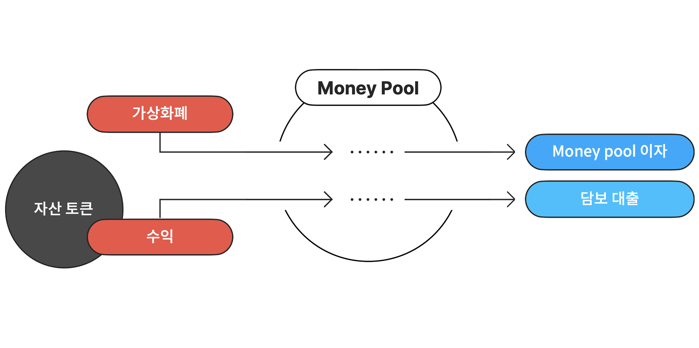

# MoneyPool

엘리파이에서 대부분의 유저 행동은 MoneyPool 컨트랙트를 통해 이루어집니다.  MoneyPool 컨트랙트는 예치, 출금, 대출, 상환, 청산, 데이터 조회, 새로운 유동성 종류 추가, 몇가지 운영상 필요한 함수들을 지원합니다.

| Network | Address |
| --- | --- |
| Etheruem Mainnet | [0xa93008fD32EB24E488DDAA6C0aA152559fDa9E8c](https://etherscan.io/address/0xa93008fD32EB24E488DDAA6C0aA152559fDa9E8c) |
| BSC mainnet | [0x0bdFef5f8B75741d33a22d85022244CBE793DA24](https://bscscan.com/address/0x0bdFef5f8B75741d33a22d85022244CBE793DA24) |

자세한 컨트랙트 스펙은 [Moneypool 문서](https://github.com/elysia-dev/elyfi/blob/master/docs/MoneyPool.md)를 참고해주세요.