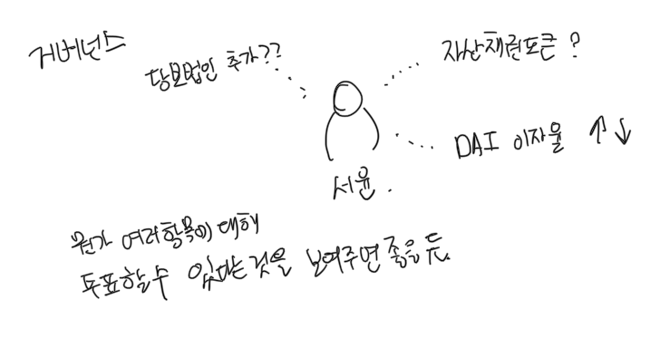

# 거버넌스 참여

엘리파이의 거버넌스 토큰인 ELFI는 엘리파이 프로토콜을 이롭게 하는 방향으로 행동했을 때 얻을 수 있는 토큰입니다. 서윤이는 과거에 예치를 해서 ELFI 토큰을 100,000개를 보유하고 있었고 이를 이용해 더 많은 수익을 얻기 위해 거버넌스를 참여하기로 했습니다. 엘리파이의 방향이 올바른 방향일수록, 엘리파이는 더 많은 대출과 더 많은 참여자가 있게 되고, 이는 ELFI 토큰 가격의 상승효과를 불러옵니다. 즉 서윤이는 ELFI 토큰 가격 상승을 원하기 때문에 엘리파이 거버넌스에 적극적으로 참여하게 됩니다. 서윤이가 참여할 수 있는 거버넌스는 활동의 예시는 아래와 같습니다.

- 민준이가 생성한 자산 채권 토큰의 검증 및 대출 심사
- DAI 대출 이자율 제안을 포럼에 작성
- 새로운 담보 법인 심사 투표
- ELFI 토큰 베스팅 변경안 작성

거버넌스의 상세한 정책들은 [거버넌스 가이드](https://guide.elyfi.world/v/korean-2/governance)을 참고해주세요.