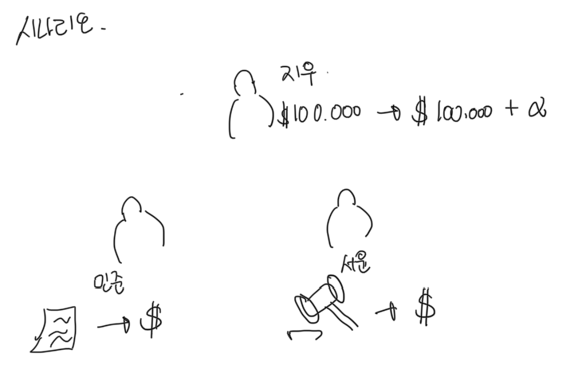

# 시나리오
엘리파이에는 크게 3가지 시나리오로 예치, 자산 채권 토큰 담보 대출 및 상환, 거버넌스 참여가 있습니다. “예치”는 USDC, DAI와 같은 스테이블 코인을 프로토콜에 맡기는 행동입니다. 예치를 하면 시간이 지난 뒤 이자를 받을 수 있습니다. “자산 채권 토큰 담보 대출 및 상환"이란 몇 가지 과정을 통해 만든 자산 채권 토큰을 담보로 예치되어있는 스테이블 코인을 대출하고 시간이 지난 뒤 대출금을 상환하는 것을 의미합니다. 거버넌스 참여란, ELFI 토큰을 스테이킹하여 투표권을 받은 뒤 투표를 통해 안건들을 결정하는 것을 뜻합니다.

- 예치
- 자산 채권 토큰 담보 대출 및 상환
- 거버넌스 참여

위 3가지 시나리오를 더  잘 이해할 수 있도록 엘리파이 프로토콜에 참여하는 인물들을 먼저 가정해 봅시다.

1. 지우 : 여유 자금으로 100,000 DAI 소유하고 있고, 이자를 받기 위해 엘리파이에 예치 하고 싶습니다.
2. 민준 : 아파트를 담보로 1억 원을 빌려 주었으며, 해당 대출로 인한 대출 채권을 소유하고 있습니다. 이 대출 채권을 담보로 엘리파이에서 스테이블 코인을 대출해서 본인의 자산을 유동화하고 싶습니다.
3. 서윤 : 엘리파이 토큰을 스테이킹하고 있으며, 대출 의사 결정 과정에 참여하여 보상을 받고 싶습니다.

위 인물들은 모두 각자의 이익을 위해 행동합니다.